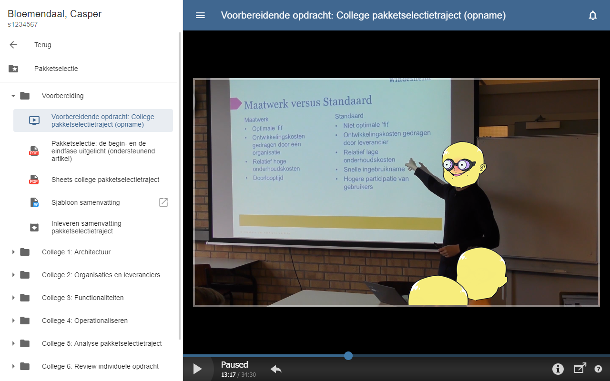
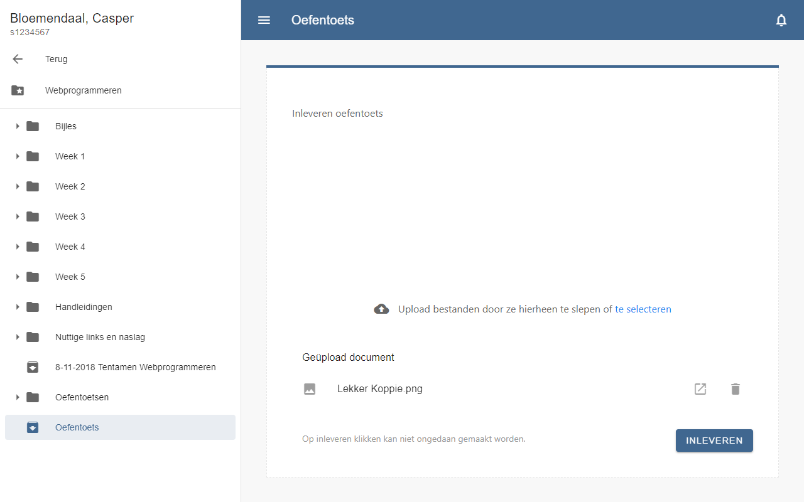
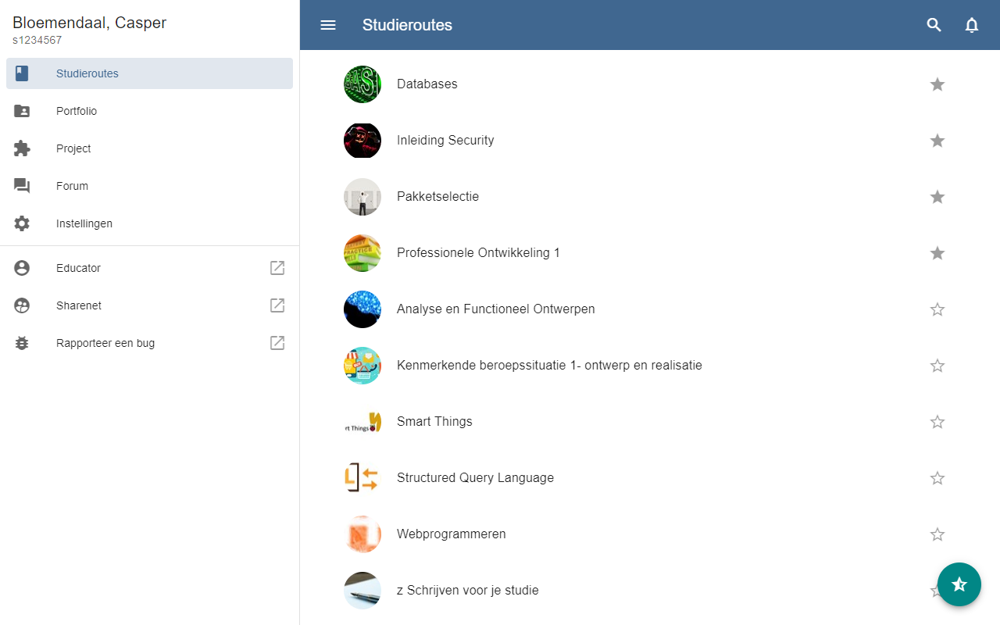

# Material Design ELO
Een material design omgeving ontworpen voor de Windesheim ELO, verkrijgbaar als [Chrome Extensie](https://chrome.google.com/webstore/detail/windesheim-elo/admnckenaonlfihjidfgpkapnhgdjpbj) (aanbevolen) en als [UserScript](https://github.com/Bloemendaal/Windesheim-ELO/raw/master/userscript/MDELO.user.js).

> “Met deze extensie is het het eindelijk waard om de ELO aan bladwijzers toe te voegen.”
> - Een leugenaar

Heb je zo je twijfels bij het installeren, dan ben je vast ook een ICT'er. Het project is open source en zal dat ook altijd blijven. Je kan per release controleren hoe de code veranderd is. De functionele code van de [Chrome Extensie](https://chrome.google.com/webstore/detail/windesheim-elo/admnckenaonlfihjidfgpkapnhgdjpbj) staat in [extension/content.js](https://github.com/Bloemendaal/Windesheim-ELO/blob/master/extension/content.js) en die van het [UserScript](https://github.com/Bloemendaal/Windesheim-ELO/raw/master/userscript/MDELO.user.js) staat in [userscript/MDELO.user.js](https://github.com/Bloemendaal/Windesheim-ELO/blob/master/userscript/MDELO.user.js). Verder worden er verschillende CSS en JS libraries gebruikt, zie de [technische documentatie](#technische-documentatie).

## Functionaliteiten
De extensie herschrijft de broncode van de ELO. Dit betekent dat de HTML van je huidige ELO compleet vervangen wordt door de [HTML van de extensie](https://github.com/Bloemendaal/Windesheim-ELO/blob/master/userscript/document.html). Vervolgens manipuleert de extensie de HTML zodat het de juiste informatie weergeeft, namelijk jouw studieroutes, portfolio, notificaties en instellingen.

### Content
De material design ELO haalt zijn content op via de JSON routes van de [mobiele weergave](https://elo.windesheim.nl/Pages/Mobile/index.html) van de ELO. Dit gebeurt altijd met `jQuery.ajax()` of `jQuery.load()`. De ELO kan momenteel de volgende onderdelen ophalen:
- Een overzicht met jouw studieroutes/portfolios met geïntegreerde zoekfunctie en sorteerfunctie.
- De mapinhoud van een studieroute/portfolio.
- De bestanden in de mappen van de studieroute/portfolio, weergegeven als download, in een iframe of geïmplementeerd in de HTML.
- Notificaties ontvangen en weergeven in een iframe.
- Persoonlijke instellingen inlezen. Mocht je hier je twijfels bij hebben, dit wordt gedaan met de eerste `jQuery.ajax()` in de[ `initELO()`](#initELO) functie. Jouw naam, studentnummer, weergavetaal en actieve sessie (boolean) worden uitsluitend voor het weergeven van de ELO gebruikt en zullen nooit worden verspreidt!
- Een iframe met daarin het forum, deze moet nog ontwikkeld worden als material design component.

De material design ELO verstuurt ook content naar de server:
- Bestanden die je upload via de inlevermodule. Deze bestanden worden als tijdelijke bestanden op de server van Windesheim opgeslagen en worden nooit gedeeld. Dit gebeurt altijd met de `UIkit.upload()` functie.
- Het inleveren van bestanden, hiermee lever je geüploadde bestanden in. Deze functie kan niet ongedaan gemaakt worden, het inleveren van bestanden is altijd definitief. Deze extensie is niet verantwoordelijk voor fouten bij het inleveren van bestanden gezien de functionaliteit van de 'inleveren' knop precies hetzelfde is als op de normale ELO.
- Het verwijderen van tijdelijke bestanden, ook dit kan niet ongedaan gemaakt worden. Deze extensie is niet verantwoordelijk voor fouten bij het inleveren van bestanden gezien de functionaliteit van de 'verwijderen' knop precies hetzelfde is als op de normale ELO.
- Wanneer je op een ongelezen notificatie klikt, wordt deze als gelezen gemarkeerd.
- Jouw zoektermen worden verstuurd naar de ELO.
- Studieroutes als favoriet markeren en verwijderen wordt verstuurd naar de ELO.

De material design ELO verstuurt geen enkele log bestanden, toch is het mogelijk dat de ELO aan de hand van de functies die content aanvragen kan zien waar je op geklikt hebt.

### Navigatie
De material design ELO heeft een geavanceerd navigatiesysteem. Alle acties worden verwerkt als een zogenaamde `history.pushState()` waardoor je gewoon kan navigeren met de vorige & volgende knoppen zonder dat de pagina moet herladen. De material design ELO kan links aflezen waardoor het juiste item geladen kan worden wanneer je bijvoorbeeld de pagina herlaadt, dit maakt ook het delen van links mogelijk tussen mensen die beide de extensie hebben.

## Screenshots
Een aantal screenshots van de material design ELO, genomen van [v1.5.3](https://github.com/Bloemendaal/Windesheim-ELO/tree/v1.5.3).

De weergave van een PDF bestanden.


De weergave van een opgenomen hoorcollege.


De weergave van de inlevermodule.


Het overzicht van alle studieroutes.


Het overzicht van alle portfolios met een geopend notificatiescherm.

## UserScripts installeren
Zorg dat de plugin Tampermonkey ([Chrome](https://chrome.google.com/webstore/detail/tampermonkey/dhdgffkkebhmkfjojejmpbldmpobfkfo)) of Greasemonkey ([Firefox](https://addons.mozilla.org/nl/firefox/addon/greasemonkey/)) geïnstalleerd is en open vervolgens het [userscript/MDELO.user.js](https://github.com/Bloemendaal/Windesheim-ELO/raw/master/userscript/MDELO.user.js) bestand. Als het goed is, opent een pagina om hem te installeren. Zo niet, dan kan je het bestand downloaden en handmatig installeren.

## Technische documentatie
De technische documentatie bevat een korte uitleg van alle [functies met parameters](#functies-met-parameters) en de belangrijkste [arrays, objecten & variables](#arrays-objects--variables).

### Dependencies
Met dank aan de volgende libraries!
- [jQuery](https://github.com/jquery/jquery)
- [Material Design Components](https://github.com/material-components/material-components-web)
- [UIkit](https://github.com/uikit/uikit)
- [Material Icons](https://github.com/google/material-design-icons)

### Functies met parameters
#### printLanguages
```js
var obj = {
   en: 'This function returns a span with class lang-key for each property',
   nl: 'Deze functie geeft een span met de class lang-key voor elke property'
}

var result = printLanguages(obj);
// Expected output:
// <span class="lang-en">
//    This function returns a span with class lang-key for each property
// </span>
// <span class="lang-nl">
//    Deze functie geeft een span met de class lang-key voor elke property
// </span>
```
Deze functie geeft een span met de class lang-key voor elke property van het gegeven object. Mocht de parameter een string zijn, dan wordt ervan uitgegaan dat de string geen meerdere talen heeft en plaintext gereturned.


#### setPage
```js
setPage(k, t = null, ignoreState = null);

var display = {
   nav: 'menu || folder',              // Navigatiemenu aan de zijkant, keuze uit menu of folder
   container: 'list',                  // Hoofdcontainer, keuze uit list, folder, iframe of include
   search: Boolean,                    // Zoekbalk weergeven, Boolean
   fab: 'icon'                         // FAB weergeven, false of icoon
}
```
Deze functie maakt de pagina klaar om van content te veranderen aan de hand van de key (`k`) van de array [`pages`](#pages). Wanneer een pagina herkend wordt, zal deze met de globale variable `tab` ingesteld worden. De pagina kan ook alleen met een `display` (`k`) object klaargemaakt worden. Er kan een titel (`t`) toegevoegd worden die wordt weergegeven in de topAppBar geladen met [`printLanguages()`](#printLanguages). Als laatst kan `ignoreState` op `true` of `false` gezet worden om de functie `history.pushState()` wel of niet uit te laten voeren (default is wel uitvoeren). Wanneer de `t` `true` of `false` is en de `ignoreState` leeg gelaten, wordt `t` beschouwd als `ignoreState`. Wanneer `t` leeg is en `k` een key van array [`pages`](#pages) is, wordt de titel uit [`pages`](#pages) gebruikt.


#### setCourses
```js
setCourses(search = '');

var favoriteCourses = 0 || -1;         // 0 voor alle studieroutes, -1 voor alleen favoriete studieroutes
```
Deze functie maakt een `jQuery.ajax()` request om zo een JSON op te halen met daarin de studieroutes, waaruit een lijst gegenereerd wordt, gesorteerd op favoriet, alfabet. `search` is een optionele parameter die kan worden gebruikt om naar studieroutes te zoeken. Er wordt rekening gehouden met de globale variable `favoriteCourses`, waardoor alle of alleen favoriete studieroutes weergegeven worden.


#### setPortfolios
```js
setPortfolios(search = '');
```
Deze functie maakt een `jQuery.ajax()` request om zo een JSON op te halen met daarin de portfolios, waaruit een lijst gegenereerd wordt, gesorteerd op ismain, alfabet. `search` is een optionele parameter die kan worden gebruikt om naar portfolios te zoeken.


#### setFolder
```js
// Standaardfunctie:
setFolder(append, id, parent = -1, npath = false);

// Interpretatie
setFolder(append, id, parent = -1);
setFolder(append, i, parent = -1, npath);
```
Deze functie genereert een lijst met mappen en items, afhankelijk van de huidige pagina, verkregen uit de globale variable `tab`. Hiervoor maakt de functie herhaaldelijk gebruik van de [`prepareItemType()`](#prepareItemType) functie. De parameter `append` is een `jQuery()`-object of een lijst van `jQuery()`-objecten. Deze elementen zullen eerst leeggemaakt worden en vervolgens gevuld worden met de mapinhoud. Een uitzondering is een map in het navigatiemenu, dit element wordt niet aangepast. In plaats daarvan wordt er een nieuw element aangemaakt achter de map om zo de submap weer te kunnen geven. `parent` is een integer die standaard -1 is (hoofdmap van de studieroute), die kan worden ingevuld met het ID van de hoofdmap. Het `id` is in dit geval het ID van de studieroute of het portfolio. Wanneer `npath` gedefinieerd is, is het opgeven van het ID niet nodig en wordt deze vervangen door `i`, de huidige voortgang van de loep die doorlopen wordt bij het laden vanuit een URL, zie [`readURL()`](#readURL). Het ID van de course wordt dan vanuit de `npath` uitgelezen. `npath` is array gegenereerd met de [`preparePath()`](#preparePath) functie. Met `i` gedefinieerd zal de functie verder gaan met [`readFolderURL()`](#readFolderURL).


#### setFolderItem
```js
setFolderItem(t, e = null);
```
Deze functie bepaalt wat er moet gebeuren wanneer er op een item in de map geklikt wordt, ook wordt de `history.pushState()` functie uitgevoerd. Hierbij is `t` het element waarop wordt geklikt (this) en `e` het element dat gebruikt wordt om de target te bepalen. Naast het klikken op een item in de map weergave, wordt de functie ook gebruikt door de [`readFolderURL()`](#readFolderURL) functie, die aan het einde van de loep het gewenste item laadt.
De functie maakt gebruik van [`preparePath()`](#preparePath), [`prepareItemPath()`](#prepareItemPath), [`setPage()`](#setPage), [`setFolder()`](#setFolder), [`setIframe()`](#setIframe) en [`printLanguages()`](#printLanguages).


#### setIframe
```js
setIframe(src = 'about:blank');
```
Deze functie moet gebruikt worden bij het instellen van een nieuwe `src` van de iframe omdat op deze manier er geen history wordt toegevoegd.


#### prepareFolder
```js
prepareFolder(page, id, title);
```
Deze functie wordt alleen gebruikt wanneer er vanuit het overzicht studieroutes of portfolios genavigeerd wordt naar een specifiek(e) studieroute/portfolio. Het bereidt de pagina voor door de functies [`setPage()`](#setPage), `history.pushState()`, [`preparePath()`](#preparePath) en [`setFolder()`](#setFolder) op de juiste manier op te roepen.


#### prepareItemPath
```js
var path = prepareItemPath(t, id = null);
// Example:
// 33677888/33677901
```
Deze functie loept zichzelf totdat het volledige path van een item bepaald is. `t` is hierbij het `jQuery()`-object van het item in de navigatiebalk en `id` is het ID van het item. Wanneer de loep doorlopen is, wordt er een path gereturned die vervolgens in de URL gebruikt kan worden.


#### prepareItemType
```js
var properties = prepareItemType(url, it, comp = null);
// Expected output:
// {
//    display: { ... },
//    icon: 'icon',
//    label: 'label',
//    color: 'color'
// }
```
Deze functie geeft aan de hand van de array [`itemTypes`](#itemTypes) een object met daarin een display, icon, label en color. `url` is de URL van het item waarmee de bestandnaamextensie bepaald wordt. `it` is het itemtype van het huidige item. Items in een studieroutes hebben echter niet dezelfde itemtypes als in een portfolio, vandaar dat de variable `comp` ingevuld kan worden om de naam van een pagina te definiëren (bijvoorbeeld 'studyroute'). Wanneer `comp` niet gedefinieerd is, zal de naam van de huidige pagina gebruikt worden.


#### prepareHandin
```js
prepareHandin(resource);
```
Deze functie bereidt de inleverpagina voor met de `resource` ID van de assignment. Er wordt gebruik gemaakt van de functies [`prepareItemType()`](#prepareItemType), [`prepareHandinHTML()`](#prepareHandinHTML) en [`printLanguages()`](#printLanguages).


#### prepareHandinHTML
```js
var html = prepareHandinHTML(url, name, properties);

var properties = {
   icon: 'icon',
   color: 'color',
   label: 'label',
   delete: {
      id: Int,             // CPID van het ingeleverde document
      assignment: Int      // ID van de resource
   }
}
```
Deze functie genereert HTML voor de functie [`prepareHandin()`](#prepareHandin) aan de hand van de meegegeven `url`, `name` en `properties`.


#### preparePath
```js
var path = preparePath(toLower = true);
// Expected output:
// [
//    'courses',
//    '1234',
//    '5678'
// ]
```
Deze functie genereert een array van de huidige getrimde `location.pathname` standaard zonder hoofdletters, eventueel aan te passen door `toLower` op false te zetten.


#### favoriteCourse
```js
favoriteCourse(id, e, $this);
```
Deze functie schakelt de favoriete status van de studieroute aan en uit waarbij `id` het ID van de studieroute is, `e` nodig is voor het bepalen van de target en `$this` nodig is voor het verschuiven van het lijstitem. De functie wordt alleen aangeroepen vanuit de container functie van `pages.name == 'courses'`.


#### readURL
```js
readURL(e = false);
```
Deze functie leest de URL af nadat de URL geüpdatet is door de navigatieknoppen via `window.onpopstate`. Deze laadt ook de pagina wanneer hij nog niet geladen was en roept daarvoor [`initELO()`](#initELO) op. Om het laden elke specifieke pagina mogelijk te maken, maakt deze functie gebruik van de volgende functies: [`preparePath()`](#preparePath), [`setPage()`](#setPage), [`readFolderURL()`](#readFolderURL), [`setFolderItem()`](#setFolderItem), [`setFolder()`](#setFolder) en [`setIframe()`](#setIframe).

De functie kijkt naar een aantal belangrijke aspecten. Allereerst of de opgegeven URL bestaat volgens de array [`pages`](#pages), vervolgens of de pagina al geladen is en dan of hij te maken heeft met een folder, een notificatie of een menu. Wanneer de URL niet bestaat volgens de array [`pages`](#pages) en geen 'security' of 'cms' pagina is, wordt de gebruiker doorgestuurd naar de inlogcontrole.


#### readFolderURL
```js
readFolderURL(npath, i);

var npath = prepareFolder();
```
Een speciale functie die voor [`readURL`](#readURL) een loep met zichzelf en [`setFolder()`](#setFolder) om te checken of de huidige mappen bestaan in het navigatiemenu. Als de mappen niet bestaan, worden deze aflopend ingeladen. Wanneer de laatste ID van de `npath` gecheckt wordt, wordt de functie [`setFolderItem()`](#setFolderItem) gebruikt en de loep stopgezet. De voortgang van de loep wordt bepaald met `i`.


#### initELO
```js
initELO();
```
Deze functie herschrijft de volledige HTML, laadt de benodigde gebruikersdata en notificaties, genereert het menu en zet alle eventlisteners voor de pagina. Verder wordt de inlevermodule, de snackbar, de drawer en het notificatiemenu voorbereidt. Deze functie wordt altijd opgeroepen door [`readURL()`](#readURL).


### Arrays, Objects & variables
#### pages
```js
var pages = [
   {
      name: 'string',                        // Universele naam van de pagina
      title: {                               // Een object van titels in Engels, Nederlands en Duits
         en: 'String',              
         nl: 'Draad',
         de: 'Draht'
      },
      icon: 'icon',                          // Naam van het icoon dat moet worden weergegeven
      showInNav: Boolean,                    // Wordt weergegeven in de navigatiebalk, true bij default
      display: {                             // Onderdelen van de website die moeten worden weergegeven
         nav: 'menu || folder',              // Navigatiemenu aan de zijkant, keuze uit menu of folder
         container: 'list',                  // Hoofdcontainer, keuze uit list, folder, iframe of include
         search: Boolean,                    // Zoekbalk weergeven, Boolean
         fab: 'icon'                         // FAB weergeven, false of icoon
      },
      functions: {
         onload:    function() { ... },         // Functie die uitgevoerd wordt wanneer de pagina laadt
         onunload:  function() { ... },         // Functie die uitgevoerd wordt voordat een andere pagina geladen wordt
         search:    function(q) { ... },        // Zoekfunctie met variable q als zoekopdracht
         container: function(t, e) { ... },     // Klikfunctie van de container, wordt alleen bij display container list uitgevoerd met variable t als this en e
         navback:   function() { ... },         // Klikfunctie van de terugknop in de nav.
         fab:       function() { ... }          // Klikfunctie van de FAB
      }
   },
   { display: 'hr' },                        // Wanneer er een HR weergegeven moet worden
   {
      name: 'educator',
      title: 'Educator',
      icon: 'account_circle',
      display: {
         link: '//educator.windesheim.nl'       // Wanneer er een link weergegeven moet worden in plaats van een pagina
      }
   }
   { ... }                                   // Pagina's worden op volgorde ingeladen
]
```
Pages definieert alle mogelijke pagina's. Er kunnen naast deze vooraf ingestelde pagina's ook nog andere pagina's ingeladen worden door de [`setPage(display, title = null)`](#setPage) functie te gebruiken, waarin `display` een object is `{nav: String, container: String}` en titel een optionele titel is, in te laden als Object voor meerdere talen of als String.


#### itemtypes
```js
var itemTypes = [
   {
      id: {
         studyroute: 0,          // ID per pages.name
         portfolio: -1
      },
      icon: 'folder',            // Icoon dat gebruikt moet worden
      display: 'folder',         // Weergave van de container
      ext: [
         {
            ext: ['pdf'],        // Weergave met een bepaalde extensie
            label: 'PDF',
            color: '#f44336',
            display: 'iframe'
         },
         { ... }
      ]
   },
   { ... }
]
```
Deze array bevat alle mogelijke items die ingeladen kunnen worden. Gezien de IDs van de items verschillen per pagina, is `id` een object met daarin per pagina het bijbehorende item ID. Een `icon` en een `display` zijn verplicht, een `label`, `color` of `ext` zijn optioneel. Wanneer `ext` gedefinieerd is, worden de hoofdeigenschappen overschreven wanneer de bestandnaamextensie overeenkomt met die van de array `ext` (in `ext`).


#### languages
```js
var languages = {
   en: {
      key: 'string',             // String die de ELO zelf gebruikt voor het aangeven van de taal.
      title: {
         en: 'English',
         nl: 'Engels',
         de: 'Englisch'
      },
      svg: 'html'                // SVG HTML van de vlag
   },
   xx : { ... }
}
```
Dit object bevat alle talen die geladen kunnen worden op de ELO, met hun afkorting gebruikt in de CSS als key. De `key` van het suboject is een string die de ELO zelf gebruikt voor het aangeven van de taal. De `title` bevat voor elke taal in object `languages` een vertaling. De svg is de vlag die ingeladen wordt.
